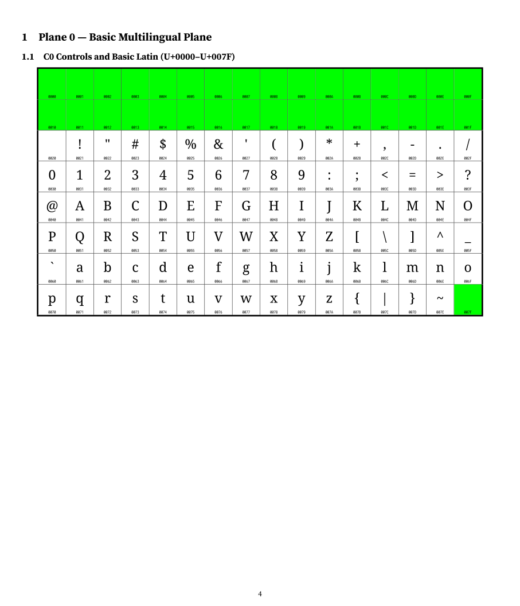
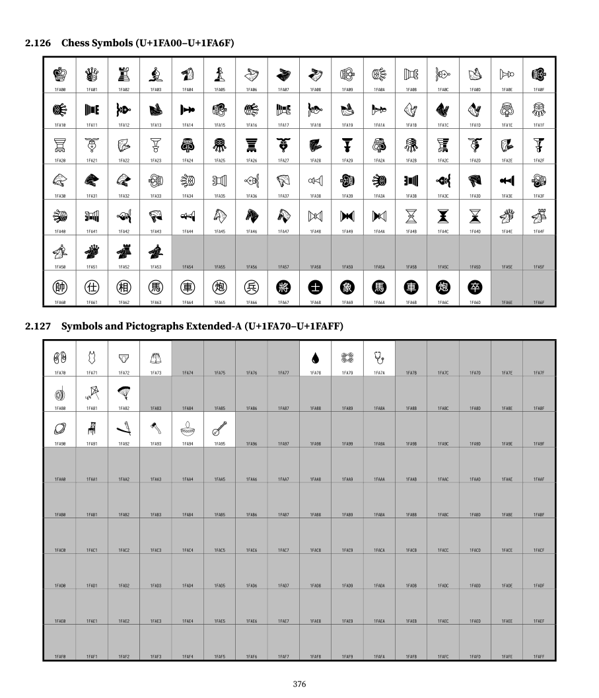
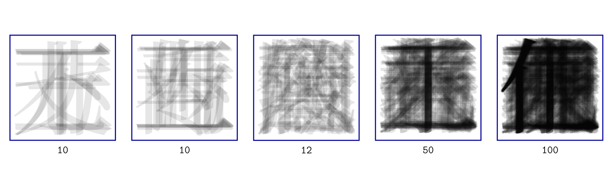
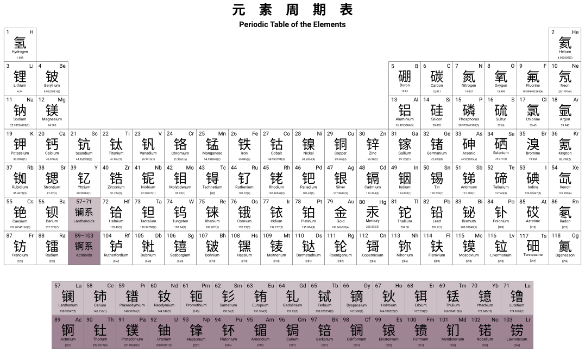
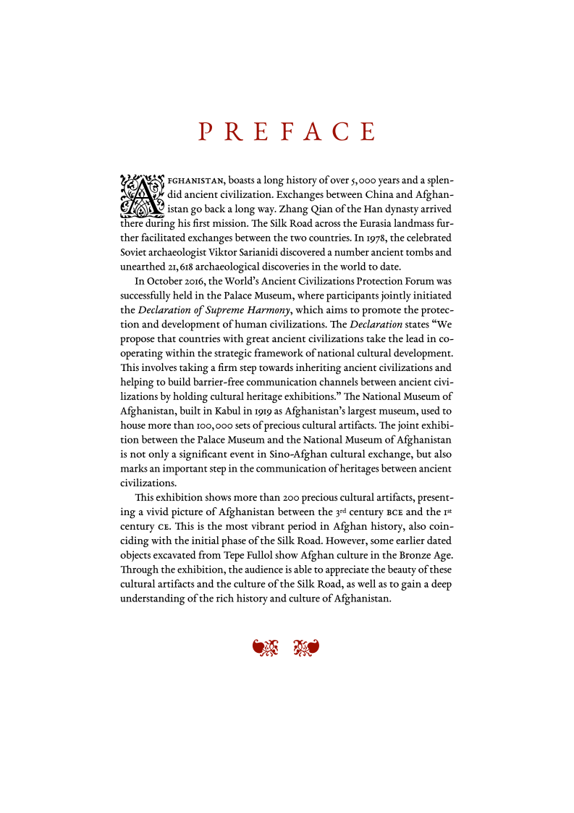

# LaTeX Showcase

## `codecharts` - Unicode code charts

    
    
    

## `han-overlay` - Overlay experiments of Chinese characters

    

## `neogo` - Japanese era name (日本年号, げんごう)

    

## `periodic-table` - Periodic Table of the Elements (元素周期表)

    

## `pinyin` - Scheme for the Chinese Phonetic Alphabet (汉语拼音方案)

    
    
    

## `textcircle-cid` - Use circled numbers via CID

    

## `wenying` - Homework for Wenying Jiangtan 2019 (文瀛讲坛 2019)

    

